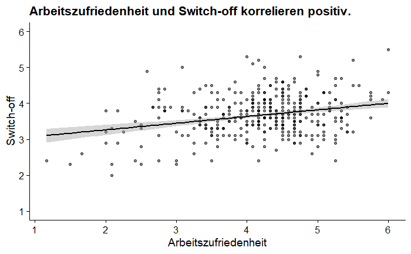
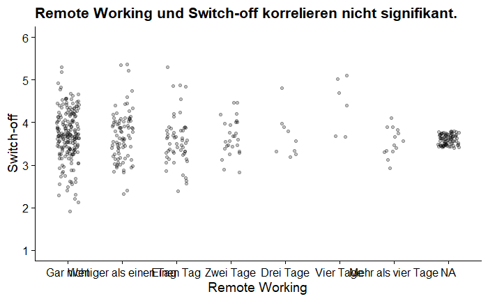
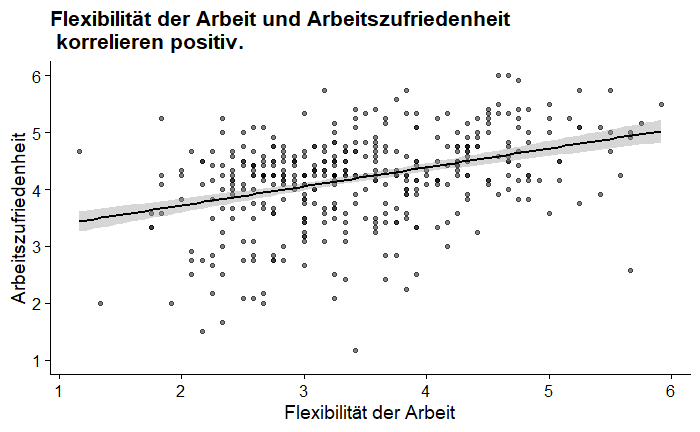
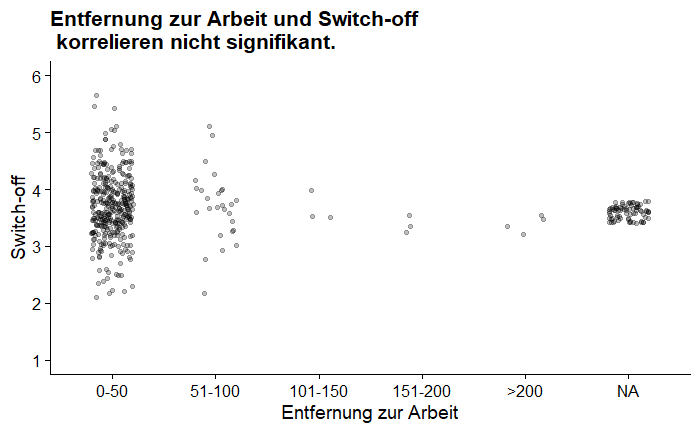
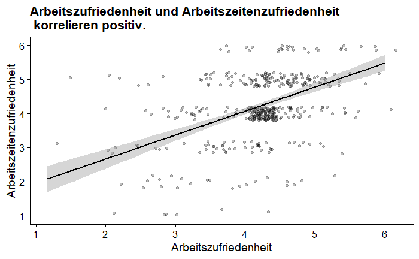
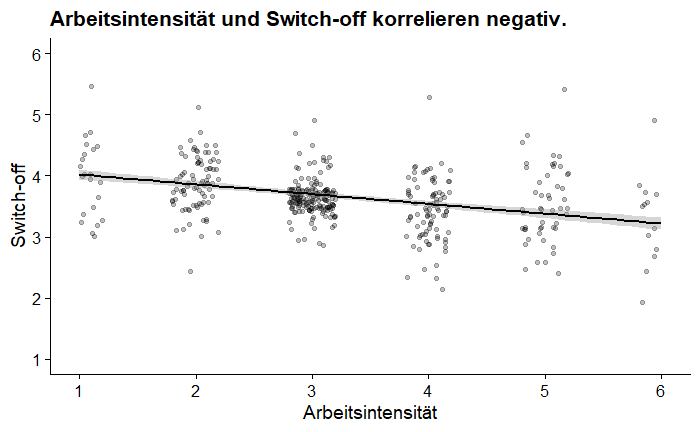
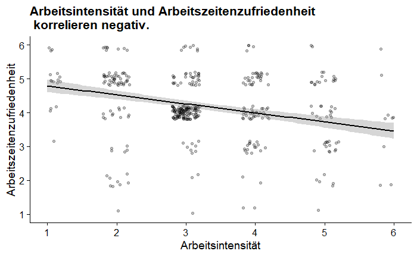

```{r setup, include=FALSE}
knitr::opts_chunk$set(echo = TRUE)


library(tidyverse)
library(jmv)
library(ggplot2)

df <- readRDS("data.rds")

```


<br>

# Unterschiede


```{r include=FALSE}

("Hypothese 1: Mitarbeiter, die mit ihren Arbeitszeiten zufrieden sind, weisen einen besseren Switch-Off auf.")

#einfacher t-test
#t.test(as.numeric(df$SOFF_GR), mu=3.5)


# hier wichtig bestimmen, welche Gruppen wir vergleichen wollen, und ob eine Anova mehr Sinn macht

df_AZZ_GR_unzufrieden <- filter(df, AZZ_GR == "unzufrieden")
df_AZZ_GR_zufrieden <- filter(df, AZZ_GR == "zufrieden")
df_AZZ_GR_sehrzufrieden <- filter(df, AZZ_GR == "sehr zufrieden")


#JRH: Das hier geht:
#t.test(as.numeric(df_AZZ_GR_unzufrieden$SOFF_GR), as.numeric(df_AZZ_GR_sehrzufrieden$SOFF_GR))


#U-Test (brauchen wir wahrscheinlich nicht)
#df_AZZ_GR_unzufrieden$SOFF_GR <- as.numeric(df_AZZ_GR_unzufrieden$SOFF_GR)
#df_AZZ_GR_sehrzufrieden$SOFF_GR <- as.numeric(df_AZZ_GR_sehrzufrieden$SOFF_GR)

#wilcox.test(df_AZZ_GR_unzufrieden$SOFF_GR, df_AZZ_GR_sehrzufrieden$SOFF_GR)


#t.test(df_AZZ_GR_unzufrieden$SOFF, df_AZZ_GR_sehrzufrieden$SOFF)
#t.test(df_AZZ_GR_unzufrieden$SOFF, df_AZZ_GR_zufrieden$SOFF)

#t.test(df_AZZ_GR_zufrieden$SOFF, df_AZZ_GR_unzufrieden$SOFF)
#t.test(df_AZZ_GR_sehrzufrieden$SOFF, df_AZZ_GR_unzufrieden$SOFF)


df %>% ANOVA(dep = "SOFF", factors = c("AZZ_GR"))

             
             
#("In der Stichprobe fällt Menschen, die mit ihren Arbeitszeiten zufrieden sind, der Switch Off leichter als Menschen, die mit ihren Arbeitszeiten unzufrieden sind. Dieser Unterschied ist signifikant. (t(41.54 = -2.407, P < .05) und liegt mit 95% Sicherheit zwischen 0.05 und 0.57 Punkten einer 6-stufigen Skala.")

```

<br>


#### Hypothese 1:

Mitarbeiter, die mit ihren Arbeitszeiten zufrieden sind, weisen einen besseren Switch-off auf.

Es gibt einen signifikanten Unterschied zwischen der Arbeitszufriedenheit und dem Switch off ($p<0.001$). Es gibt einen signifikanten Unterschied zwischen der Arbeitszeit und dem Switch off $F(2)=11.7$, $p<0.001$.
In der Stichprobe fällt Menschen, die mit ihren Arbeitszeiten zufrieden sind, der Switch Off leichter als Menschen, die mit ihren Arbeitszeiten unzufrieden sind. Dieser Unterschied ist signifikant $(t(41.54=-2.407$, $p<0.05$) und liegt mit 95% Sicherheit zwischen 0.05 und 0.57 Punkten einer 6-stufigen Skala.


```{r include=FALSE}
("Hypothese 2: Mitarbeiter mit geringerer Arbeitszeit (bis zu 29 Std. pro Woche) und geringerer Arbeitsintensität (keine Überstunden) weisen einen besseren Switch-Off auf.")


df %>% ANOVA(dep = "SOFF", factors = c("AZ_GR", "AI_GR"))
             
             
             #effectSize = "partEta", 
             #postHoc = SOFF ~ AZ_GR,
             #emMeans = ~ AZ_GR, 
             #emmPlots = TRUE)
  

#df$SOFF_GR <- as.numeric(df$SOFF_GR)

#df %>% 
  #ANOVA(dep = "SOFF_GR", factors = c("AZ_GR", "AI_GR"))


```

<br>

#### Hypothese 2
Mitarbeiter mit geringerer Arbeitszeit (bis zu 29 Std. pro Woche) und geringerer Arbeitsintensität (keine Überstunden) weisen einen besseren Switch-off auf.

Es gibt keinen signifikanten unterschied zwischen der Arbeitszeit und dem Switch off ($p>0.05$). Anders ist es bei der Arbeitintensität und dem Switch off, hier gibt es einen signifikanten Unterschied ($p<0.001$). 
Betrachtet man Arbeitszeit und -intensität in Bezug auf den Switch off, gibt es wiederum keinen signifikanten Unterschied ($p>0.05$).


```{r include=FALSE}

("Hypothese 3: Mitarbeiter, die länger (über den Mediansplit der Arbeitsjahre) in der aktuellen Jobposition beschäftigt sind, weisen einen besseren Switch-Off auf.") 

#hilfestellung
# t.test(filter(data,gender == "männlich")$KUT, filter(data, gender == "weiblich")$KUT)


#### das hier noch gucken wie das geht ->      

#t.test(filter(df, AD_GR == "0:1")$SOFF, filter(df,AD_GR == "2:5")$SOFF)


```
<br>

#### Hypothese 3
Mitarbeiter, die länger (über den Mediansplit der Arbeitsjahre) in der aktuellen Jobposition beschäftigt sind, weisen einen besseren Switch-off auf.

Hypothese konnte nicht getestet werden.


```{r include=F}

("Hypothese 4: Mitarbeiter, die den Großteil der Woche (drei oder mehr Tage) nicht am Arbeitsplatz arbeiten, weisen einen schlechteren Switch-Off auf.")


### funktioniert noch nicht


#df_MA_GR_geringerAnteil <- filter(df, MA_GR == "geringer Anteil der Woche (≤ 2 Tage/Woche)")
#df_MA_GR_Grossteil <- filter(df, MA_GR == "Großteil der Woche (≥ 3 Tage/Woche)")


#   t.test(filter(df, MA_GR == "geringer Anteil der Woche (≤ 2 Tage/Woche)")$SOFF, filter(df,MA_GR == "Großteil der Woche (≥ 3 Tage/Woche)")$SOFF)


```

<br>


#### Hypothese 4:
Mitarbeiter, die den Großteil der Woche (3 Tage oder mehr) nicht am Arbeitsplatz arbeiten, weisen einen schlechteren Switch-off auf.

Hypothese konnte nicht getestet werden.


```{r include=FALSE}

("Hypothese 5: Mitarbeiter, die flexibel in ihrem Job sind, weisen einen besseren Switch-Off und eine höhere Arbeitszufriedenheit auf.")
# One way Manova


#ist das selbe wie unten
#obwohl wir hier eine manova rechnen, benutzen wir mancova, da in dieser Funktion der covs Wert (Covariate) standardmäßig auf NULL steht
#df %>% mancova(dep = c("SOFF", "ZUFR"), factors = "FLEX")

mancova(df, deps = c("SOFF", "ZUFR"), factors = "FLEX")


```

<br>


#### Hypothese 5:
Mitarbeiter, die flexibel in ihrem Job sind, weisen einen besseren Switch-off und eine höhere Arbeitszufriedenheit auf.

Es gibt keinen signifikaten Unterschied zwischen der Arbeitsintensität und dem Switch Off ($p>0.05$).
Anders ist es bei der Arbeitsflexibilität und der Arbeitszufriedenheit. Hier besteht ein signifikanter Unterschied ($p<0.001$).


<br>
<br>


# Korrelationen

```{r include=FALSE}

# Hypothese 1: Arbeitszufriedenheit, Switch-off

#### Hypothesen "richtig reinschreiben"

## Anpassung JRH: Das sind einzelne Items. Methodisch ist das okay, solange wir Spearman oder Kendall verwenden. Die Funktion cor() braucht aber zwei numerics. 

#cor(as.numeric(df$ZUFR_GR), as.numeric(df$SOFF_GR), method = "spearman")
#cor(as.numeric(df$ZUFR_GR), as.numeric(df$SOFF_GR), method = "kendall")

#cor.test(as.numeric(df$ZUFR_GR), as.numeric(df$SOFF_GR), method = "spearman")
#cor.test(as.numeric(df$ZUFR_GR), as.numeric(df$SOFF_GR), method = "kendall")


#cor(df$ZUFR, df$SOFF, method = "pearson") #nicht geeignet
#cor(df$ZUFR, df$SOFF, method = "spearman")
#cor(df$ZUFR, df$SOFF, method = "kendall")

#cor.test(df$ZUFR, df$SOFF, method = "spearman")


cor.test(df$ZUFR, df$SOFF, method = "kendall")

# das hier bei Gruppen, jedoch für uns wahrscheinlich unwichtig: 

#df %>% ggplot() + aes(x = ZUFR_GR, y = SOFF_GR) + geom_jitter(alpha = 0.25, width = 0.2, height = 0.2) + geom_smooth(method = lm, color = "black") + cowplot::theme_half_open() + labs(x = "Zufriedenheit", y = "Switch-off", title = "robo_bed und robo_med korrelieren positiv.")


```

<br>


#### Hypothese 1:
Je höher die  Arbeitszufriedenheit, desto einfacher fällt der Switch-off.

Es gibt einen positiven signifikanten Zusammenhang zwischen der Arbeitszufriedenheit und dem Switch-off ($\tau = 0.123$, $p<0.001$). Das bedeutet, dass mit steigender Arbeitszufriedenheit die Fähigkeit von der Arbeit abzuschalten steigt.



```{r include=FALSE}
df %>% ggplot() + aes(x = ZUFR, y = SOFF) + geom_point(alpha = 0.5) + geom_smooth(method = lm, color = "black") + cowplot::theme_half_open() + scale_y_continuous(limits= c(1,6), breaks = 1:6) + labs(x = "Arbeitszufriedenheit", y = "Switch-off", title = "Arbeitszufriedenheit und Switch-off korrelieren positiv.")
```


```{r include=FALSE}
# Hypothese 2: Position der Arbeit, Switch-off

#cor.test(as.numeric(df$JOB_GR), as.numeric(df$SOFF_GR), method = "spearman")
#cor.test(as.numeric(df$JOB_GR), as.numeric(df$SOFF_GR), method = "kendall")


cor.test(as.numeric(df$JOB_GR), df$SOFF, method = "kendall")


```
<br>


#### Hypothese 2:
Je höher die Position bei der Arbeit, desto schwieriger fällt der Switch-off.

Es gibt keinen signifikanten Zusammenhang zwischen der Position der Arbeit und dem Switch-off ($\tau=-0.054$, $p>0.05$) oder dieser konnte hier nicht festgestellt werden.


```{r include=FALSE}

df %>% ggplot() + aes(x = JOB_GR, y = SOFF) + geom_jitter(alpha = 0.25, width = 0.2, height = 0.2) + geom_smooth(method = lm, color = "black") + cowplot::theme_half_open() + scale_y_continuous(limits = c(1,6), breaks = 1:6) + labs(x = "Position der Arbeit", y = "Switch-off", title = "Arbeitsposition und Switch-off korrelieren nicht signifikant.")

```


```{r include=FALSE}
# Hypothese 3: Remote Working, Switch-off

#cor.test(as.numeric(df$MA_GR), as.numeric(df$SOFF_GR), method = "pearson")
#cor.test(as.numeric(df$MA_GR), as.numeric(df$SOFF_GR), method = "spearman")
#cor.test(as.numeric(df$MA_GR), as.numeric(df$SOFF_GR), method = "kendall")

cor.test(as.numeric(df$MA_GR), df$SOFF, method = "kendall")

```
<br>

#### Hypothese 3:
Je mehr Remote Working betrieben wird, desto schwieriger fällt der Switch-off.

Es gibt keinen signifikanten Zusammenhang zwischen Remote Working und Switch-off ($\tau=-0.054$, $p>0.05$) oder dieser konnte hier nicht festgestellt werden.



```{r include=FALSE}
df %>% ggplot() + aes(x = MA_O, y = SOFF) + geom_jitter(alpha = 0.25, width = 0.2, height = 0.2) + geom_smooth(method = lm, color = "black") + cowplot::theme_half_open() + scale_y_continuous(limits= c(1,6), breaks = 1:6) + labs(x = "Remote Working", y = "Switch-off", title = "Remote Working und Switch-off korrelieren nicht signifikant.")
```


```{r include=FALSE}
# Hypothese 4: Flexibilität, Arbeitszufriedenheit


#cor.test(as.numeric(df$FLEX_GR), as.numeric(df$ZUFR_GR), method = "spearman")
#cor.test(as.numeric(df$FLEX_GR), as.numeric(df$ZUFR_GR), method = "kendall")


#cor.test(df$FLEX, df$ZUFR, method = "spearman")
cor.test(df$FLEX, df$ZUFR, method = "kendall")

```

<br>

#### Hypothese 4

Je flexibler die Arbeit eingeteilt werden kann, desto höher ist die Arbeitszufriedenheit.

Es gibt einen positiven signifikanten Zusammenhang zwischen der Flexibilität der Arbeit und der Arbeitszufriedenheit ($\tau=0.241$, $p<0.001$). Die Arbeitszufriedenheit steigt, wenn die Arbeit flexibel eingeteilt werden kann.



```{r include=FALSE}
df %>% ggplot() + aes(x = FLEX, y = ZUFR) + geom_point(alpha = 0.5) + geom_smooth(method = lm, color = "black") + cowplot::theme_half_open() + scale_y_continuous(limits = c(1,6), breaks = 1:6) + labs(x = "Flexibilität der Arbeit", y = "Arbeitszufriedenheit", title = "Flexibilität der Arbeit und Arbeitszufriedenheit \n korrelieren positiv.")


```


```{r include=FALSE}

# Hypthese 5: Entfernung zur Arbeit, Switch-off

#cor.test(as.numeric(df$EN_GR), as.numeric(df$SOFF_GR), method = "spearman")
#cor.test(as.numeric(df$EN_GR), as.numeric(df$SOFF_GR), method = "kendall")

cor.test(as.numeric(df$EN_GR), df$SOFF, method = "kendall")

```
<br>


#### Hypothese 5: 
Je höher die Entfernung zur Arbeit, desto einfacher fällt der Switch-off.

Es gibt keinen signifikanten Zusammenhang zwischen der Entfernung zur Arbeit und dem Switch-off ($\tau=-0.034$, $p>0.05$) oder dieser konnte hier nicht festgestellt werden.



```{r include=FALSE}
df %>% ggplot() + aes(x = EN_GR, y = SOFF) + geom_jitter(alpha = 0.25, width = 0.2, height = 0.2) + geom_smooth(method = lm, color = "black") + cowplot::theme_half_open() + scale_y_continuous(limits = c(1,6), breaks = 1:6) + labs(x = "Entfernung zur Arbeit", y = "Switch-off", title = "Entfernung zur Arbeit und Switch-off \n korrelieren nicht signifikant.")
```


<br>
<br>

## weitere induktive Korrelationen


```{r include=FALSE}
jmv::corrMatrix(df, c("age", "SOFF", "ZUFR", "FLEX", "AZZ", "AI", "AD"), kendall = TRUE, plots = TRUE, plotDens = TRUE, plotStats = TRUE)


cor.test(df$ZUFR, df$AZZ, method = "kendall")

cor.test(df$AI, df$SOFF, method = "kendall")

cor.test(df$AI, df$AZZ, method = "kendall")
```

<br>

#### induktive Korrelation 1
Es gibt einen positiven signifikantenm Zusammenhang zwischen der Arbeitszufriedenheit und der Arbeitszeitenzufriedenheit ($\tau=0.357$, $p<0.001$). Die allgemeine Arbeitszufriedenheit steigt mir der Zufriedenheit bezüglich den Arbeitszeiten.



```{r include=FALSE}
df %>% ggplot() + aes(x = ZUFR, y = AZZ) + geom_jitter(alpha = 0.25, width = 0.2, height = 0.2) + geom_smooth(method = lm, color = "black") + cowplot::theme_half_open() + scale_y_continuous(limits= c(1,6), breaks = 1:6) + labs(x = "Arbeitszufriedenheit", y = "Arbeitszeitenzufriedenheit", title = "Arbeitszufriedenheit und Arbeitszeitenzufriedenheit \n korrelieren positiv.")
```

<br>

#### induktive Korrelation 2
Es gibt einen signifikanten negativen Zusammenhang zwischen der Arbeitsintensität und dem Switch-off ($\tau=-0.33$, $p<0.001$). Je höher die Arbeitsintensität, desto schwieriger fällt der Switch-off.



```{r include=FALSE}
df %>% ggplot() + aes(x = AI, y = SOFF) + geom_jitter(alpha = 0.25, width = 0.2, height = 0.2) + geom_smooth(method = lm, color = "black") + cowplot::theme_half_open() + scale_y_continuous(limits= c(1,6), breaks = 1:6) + scale_x_continuous(limits= c(1,6), breaks = 1:6) + labs(x = "Arbeitsintensität", y = "Switch-off", title = "Arbeitsintensität und Switch-off korrelieren negativ.")
```

<br>

#### induktive Korrelation 3

Es gibt einen signifikanten negativen Zusammenhang zwischen der Arbeitsintensität und der Arbeitszeitenzufriedenheit ($\tau=-0.281$, $p<0.001$). Je höher die Arbeitsintensität, desto geringer ist die Arbeitszeitenzufriedenheit.



```{r include=FALSE}
df %>% ggplot() + aes(x = AI, y = AZZ) + geom_jitter(alpha = 0.25, width = 0.2, height = 0.2) + geom_smooth(method = lm, color = "black") + cowplot::theme_half_open() + scale_y_continuous(limits= c(1,6), breaks = 1:6) + scale_x_continuous(limits= c(1,6), breaks = 1:6) + labs(x = "Arbeitsintensität", y = "Arbeitszeitenzufriedenheit", title = "Arbeitsintensität und Arbeitszeitenzufriedenheit \n korrelieren negativ.")
```

