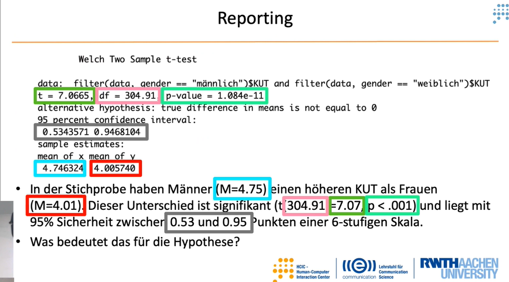
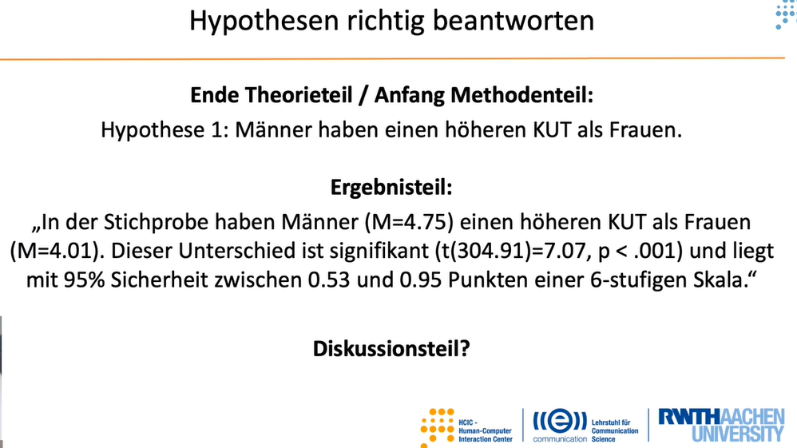

```{r setup, include=FALSE}
knitr::opts_chunk$set(echo = TRUE)
```

T-Test eignet sich nur für Unterschiedshypothesen

Es gibt 3 verschiedene T-Test

* Einfacher T-Test
* T-Test für unverbundene/ungepaarte Stichproben
* T-Test für verbundene/gepaarte Stichproben

#### Einfacher T-Test

* bezieht sich auf den Mittelwerteiner (!) Spalte und eine Konstante (Beispiel: trost_human)
* H0: Der empfundene Trost bei einer Umarmung durch einen Menschen entspricht dem theoretischen Skalenmittelwert von 3,5 (wenn Skala von 1-6 gemessen wurde).

```{r}
# t.test(data$TROST_HUMAN, mu=3.5)
```

<br>

#### T-Test für unverbundene Stichproben

* bezieht sich auf den Vergleich von genau zwei (!) (Zeilen)gruppen
* H0: Zwischen Männern und Frauen gibt es keinen Unterschied im KUT.


```{r}
# t.test(filter(data,gender == "männlich")$KUT, filter(data, gender == "weiblich")$KUT)
```

<br>

#### T-Test für verbundene Stichproben

* bezieht sich auf den Vergleich von genau zwei (!) Spalten.
* H0: Umarmungen von Robotern oder Menschen spenden gleich viel Trost.

```{r}
# t.test(data$TROST_HUMAN, data$TROST_ROBOT, paired = TRUE)
```



<br>




```{r, include=FALSE}

library(ggplot2)
ggsave("ttest_pwert.pdf", width = 210, height = 297, units = "mm")
```


