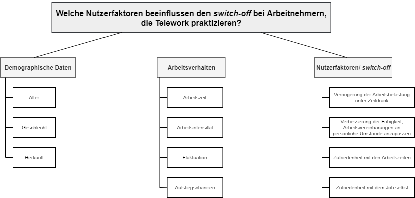

Work-Life-Balance  
================  

  
### 1. Teammitglieder 

Julia Dahmen, Susanna Formanns, Kevin Klein, Theresa Laubauch, Lukas Steinke, Freya Wolters

### 2. Forschungsfrage 

Welche Nutzerfaktoren beeinflussen den _Switch-off_ bei Arbeitnehmern, die Telework praktizieren?

### 3. Faktorenraum

Zur Klärung der Frage, welche Nutzerfaktoren den _Switch-off_ bei Arbeitnehmern beeinflussen, die Telework praktizieren, werden verschiedene Aspekte untersucht. Zu Beginn werden demographische Daten wie das Alter, das Geschlecht und die Herkunft erfragt. Um ein realistisches Bild vom Arbeitsverhalten der Probanden zu erhalten, werden Daten zu den Arbeitszeiten, der Intensität der Arbeit, der Fluktuation der Arbeitnehmer in einem Unternehmen sowie zu Aufstiegschancen erhoben. Anschließend wird abgefragt, wie Arbeitnehmer sich mit ihrer Arbeit fühlen und dementsprechend den _Switch-off_ erleben. Wie schwer die Belastung durch Arbeit unter Zeitdruck wahrgenommen wird, wie viel besser Arbeitsvereinbarungen an persönliche Umstände anpassbar werden, wie zufrieden Arbeitnehmer mit ihren Arbeitszeiten und mit ihrem Job sind, sind hier die Hauptaspekte.
  

---

  

---

 

### 4. Gemeinsame Faktoren Team A

Die Faktoren, die uns im Team gemeinsam interessieren, sind die sozialen Interaktionen der Probanden, wie flexibel ihre Arbeitsbedigungen sind sowie ihre allgemeine Arbeitszufriedenheit.

---

 

### 5. Unterschiedshypothesen:

#### Hypothese 1
* Hypothese: Mitarbeiter, die mit ihren Arbeitszeiten zufrieden sind, weisen einen besseren _Switch-off_ auf.
* Verfahren: T-Test
* H0: Mitarbeiter, die zufrieden mit ihren Arbeitszeiten sind und die, die unzufrieden mit ihren Arbeitszeiten sind, unterscheiden sich nicht im _Switch-off_.
* H1: Mitarbeiter, die zufrieden mit ihren Arbeitszeiten sind und die, die unzufrieden mit ihren Arbeitszeiten sind, unterscheiden sich im _Switch-off_.

#### Hypothese 2
* Hypothese: Mitarbeiter mit geringerer Arbeitszeit (bis zu 29 Std. pro Woche) und geringerer Arbeitsintensität (keine Überstunden) weisen einen besseren _Switch-off_ auf.
* Verfahren: two-way ANOVA
* UV: Arbeitszeit, Arbeitsintensität
* AV: _Switch-off_
* H0: Es gibt keinen Unterschied beim _Switch-off_ in Bezug auf die Arbeitszeit.
* H1: Es gibt einen Unterschied beim _Switch-off_ in Bezug auf die Arbeitszeit.

#### Hypothese 3
* Hypothese: Mitarbeiter, die länger (über den Mediansplit der Arbeitsjahre) in der aktuellen Jobposition beschäftigt sind, weisen einen besseren _Switch-off_ auf.
* Verfahren: T-Test
* H0: Die Beschäftigungsdauer der Mitarbeiter hat keinen Einfluss auf den _Switch-off_.
* H1: Die Beschäftigungsdauer der Mitarbeiter hat einen Einfluss auf den _Switch-off_.

#### Hypothese 4
* Hypothese: Mitarbeiter, die den Großteil der Woche (3 Tage oder mehr) nicht am Arbeitsplatz arbeiten, weisen einen schlechteren _Switch-off_ auf.
* Verfahren: T-Test
* H0: Der _Switch-off_ hängt nicht von der Anzahl der Tage in der Woche ab, die Mitarbeiter nicht am Arbeitsplatz verbringen.
* H1: Der _Switch-off_ hängt von der Anzahl der Tage in der Woche ab, die Mitarbeiter nicht am Arbeitsplatz verbringen.
 

#### Hypothese 5:
* Hypothese: Mitarbeiter, die flexibel in ihrem Job sind, weisen einen besseren _Switch-off_ und eine höhere Arbeitszufriedenheit auf.
* Verfahren: one-way MANOVA
* UV: Flexibilität
* AV: switch-Off, Arbeitszufriedenheit
* H0: Es gibt keinen Unterschied beim _Switch-off_ und der Arbeitszufriedenheit in Bezug auf die Flexibilität im Job.
* H1: Es gibt einen Unterschied beim _Switch-off_ und der Arbeitszufriedenheit in Bezug auf die Flexibilität im Job.
**Feedback:** Super, aber auch hier müssen Sie aus Flexibilität erst Gruppen machen. Ansonsten sehr schön! - Gruppeneinteilung habe ich gemacht-> Formulierung?

---

 

### 6. Zusammenhangshypothesen

#### Hypothese 1
* Je höher die  Arbeitszufriedenheit, desto einfacher fällt der _Switch-off_.
* H1: Die Arbeitszufriedenheit und der Switch-off korrelieren positiv.
* H0: Die Arbeitszufriedenheit und der Switch-off korrelieren nicht.

#### Hypothese 2
* Je höher die Position bei der Arbeit, desto schwieriger fällt der _Switch-off_.
* H1: Die Position der Arbeit korreliert mit dem Switch-off negativ.
* H0: Die POsition der Arbeit und der Switch-off korrelieren nicht.

#### Hypothese 3
* Je mehr Remote Working betrieben wird, desto schwieriger fällt der _Switch-off_.
* H1: Remote Working und Switch-off korrelieren negativ.
* H0: Remote Working und Switch-off korrelieren nicht.

#### Hypothese 4
* Je flexibler die Arbeit eingeteilt werden kann, desto höher ist die Arbeitszufriedenheit.
* H1: Die Flexibilität der Arbeit und die Arbeitszufriedenheit korrelieren positiv.
* H0: Die Flexibilität der Arbeit und die Arbeitszufriedenheit korrelieren nicht.

#### Hypothese 5
* Je höher die Entfernung zur Arbeit, desto einfacher fällt der _Switch-off_.
* H1: Die Entfernung zur Arbeit und der Switch-off korrelieren positiv.
* H0: Die Entfernung zur Arbeit und der Switch-off korrelieren nicht.
